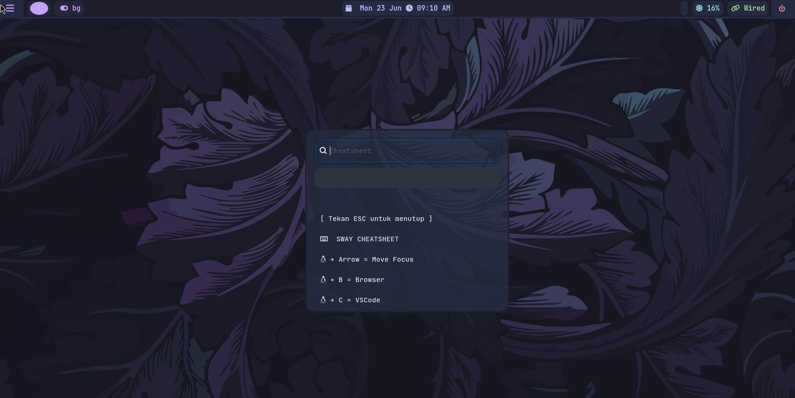

# ⚡ RunfluxOS Dotfiles & Setup for CUBIC

Ini adalah repository konfigurasi & setup otomatis untuk remaster atau personalisasi RunfluxOS (berbasis Ubuntu + Sway).

Semua konfigurasi Window Manager, Terminal, Waybar, Fonts, hingga Login Manager (LY) sudah terintegrasi dan siap dipakai.

---

## 📦 **Isi Repo Ini**

- Konfigurasi lengkap:
  - `.config/sway` → Config Sway Window Manager
  - `.config/waybar` → Config & Theme Waybar
  - `.config/wofi` → Launcher Config
  - `.config/foot` → Terminal Config
- Setup otomatis:
  - `setup-install-cubic.sh` → Master installer, panggil semua setup
  - `setup-tools-cubic.sh` → Install DevOps Tools (Docker, Ansible, Terraform, dsb)
  - `setup-apps-cubic.sh` → Install GUI apps (Brave, VSCode, Spotify)
  - `setup-wm-cubic.sh` → Setup Window Manager + copy config
  - `setup-login-cubic.sh` → Install & setup LY Login Manager
  - `setup-motd-cubic.sh` → MOTD custom saat terminal dibuka
  - `cleanup.sh` → Bersih-bersih sistem, buang sampah build & cache

---

## 🛠️ **Cara Penggunaan**

### **1. Clone Repo Ini**

```bash
git clone https://github.com/ArdhanFah/sway-cubic.git
cd sway-cubic
chmod +x setup*.sh cleanup.sh
```

### **2. Jalankan Setup Utama**
```bash
./setup-install-cubic.sh
```

### **3. Jalankan Clean Up**
```bash
./cleanup.sh
```
